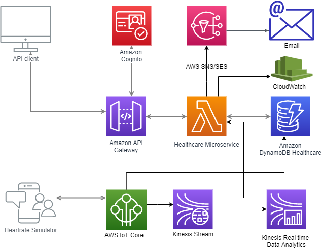

# healthcare
Healthcare app using AWS serverless architecture

# Design Diagram




# Description 

Register Patient, Provider, Device, and Patient Device mapping using rest API. Heartrate simulator generate and push heartrate data to IoT core using mqtt.
AWS IoT core execute rules to store heartrate data into Heartrate DynamoDB table and push it into kinesis stream,  Kinesis Data Analytics execute SQL runtime analytics to detect abnormal heartrate and publish an event to "KinesisHeartRateSESHandler" to send and email to associated Provider.
 
# API to Sign-up user to Cognito user pool.
* POST URL: https://{{AWS-IP}}/Prod/signup
```
 {
	"username":"user2",
	"password":"Password@2",
	"email":"user2@gmail.com"
 }
```

# API to Sign-in user using Cognito user pool, to retrieve 'Authorization' token
*POST URL:* https://{{AWS-IP}}/Prod/signin
```
 {
	"username":"user2",
	"password":"Password@2",
 }
```

# API to Register 'Provider' 

*POST URL:* https://{{AWS-IP}}/Prod/patients
  *HEADER* "Authorization": {{token}}	
```
{
	"mobileNumber":"232323",
	"email":"vivek.gupta@abc.com",
	"firstname": "Vivek",
	"lastname":"Gupta",
	"specilization":"Physician",
	"address":"India",
	"status":"ACTIVE"
	
}
```

# API to Register 'Patient' 

*POST URL:* https://{{AWS-IP}}/Prod/patients
  *HEADER* "Authorization": {{token}}	

```
 {
	"providerId":"dml2ZWsuZ3VwdGFAYWJjLmNvbQ==",
	"firstname":"Stieve",
	"lastname":"Brook",
	"email":"tim.brook@test.com",
	"mobileNumber":"21212123",
	"address":"USA",
	"dateOfBirth":"1980-03-01"
 }
```

# API to Register 'devices' 

*POST URL:* https://{{AWS-IP}}/Prod/devices
 *HEADER* "Authorization": {{token}}	

```
 {
    "type":"HEART_RATE",
    "deviceName":"sensor1",
    "ipAddress":"10.11.89.18",
    "port":8900,
    "protocal":"mqtt"
 }
```

# API to Register Patient devices mapping

*POST URL:* https://{{AWS-IP}}/Prod/patients/{{patientId}}/devices
  HEADER "Authorization": {{token}}	

```
 {
    "deviceId": "8f825c04-09f5-4f44-9361-1dcf7248f886",
    "sensorType":"HEART_RATE",
    "deviceStatus": "ACTIVE"
 }
```

# API to Retrieve heartrate, default it will return last 10 minutes heartrate data. to see full day heartrate pass 'todayData'=true query param

*GET URL:* https://{{AWS-IP}}/Prod/patients/{{patientId}}/heartrate
  HEADER "Authorization": {{token}}	
  
# Lambda functions.

**PostProviderHandler**, used to register primary health provider, it store provider data into provider dynamoDB table

**provider table**

|Field 	| Details |
|-------:|--------|
|id 	 |partition key, Provider’s Base64 encoded email ID|
|mobile_number|	sort key, provider mobile number.|
|firstname |	String|
|lastname  |	String |
|specilization |	String|
|mobile_number	|String |
|address	|String|
|status	|ACTIVE/ INCATIVE|


**PostPatinetHandler**, used to register patient and store data into patient table

**patient table**
|Field 	| Details |
|-------:|--------|
|id 	|partition key, Patient’s Base64 encoded email ID|
|provider_id|	provider id sort key string , Provider’s Base64 encoded email ID|
|firstname|	String|
|lastname |	String|
|mobile_number |	String|
|address|	String|


**PostDeviceHandler**, used to store Device info data into device table

**device table**
|Field 	| Details |
|-------:|--------|
|id 	|Device ID “UUID” string, partition key|
|Type 	|Sensor type as sort key|
|device_name |	Device name, string |
|type	 |SensorType e.i Heart_RATE |
|ip_address |	String;|
|port|	integer|
|protocal |	String, supported protocol;|

**PostPatientDeviceHandler**, used to store Patient Device mapping info data into patient_device table

**patient_device table** 
|Field 	| Details |
|-------:|--------|
|patient_id |	partition key, Patient’s Base64 encoded email ID|
|device_id	|Device id as sort key|
|senson_type |SensorType e.i Heart_RATE|
|status|	ACTIVE/INACTIVE|

**GetHeartRateHandler**, retrieve heartrate data from heartrate table

**heartrate table**
|Field 	| Details |
|-------:|--------|
|deviceId|	partition key, deviceId |
|timestamp|	Sort key |
|payload|	Heartrate data from heartrate simulator, contains heartrate and patientId|

**KinesisHeartRateSESHandler**, used to process 'KinesisAnalyticsOutputDeliveryEvent' event and  send an email to  patient's primary health provider.
 
 

# Kinesis realtime analytics SQL script to process heart rate data.
  

``` 
    CREATE OR REPLACE STREAM "DESTINATION_SQL_STREAM" ("timestamp" timestamp, "patientId"  VARCHAR(200), "deviceId" VARCHAR(200), "value" INTEGER);
	CREATE OR REPLACE PUMP "STREAM_PUMP" AS 
	  INSERT INTO "DESTINATION_SQL_STREAM" 
	SELECT STREAM ROWTIME,
	              "patientId",
				  "deviceId",
	              AVG("COL_value") AS heart_rate
	FROM     "SOURCE_SQL_STREAM_001"
	GROUP BY "patientId", "deviceId",
	         STEP("SOURCE_SQL_STREAM_001".ROWTIME BY INTERVAL '60' SECOND) HAVING AVG("COL_value") > 120 OR AVG("COL_value") < 40;
``` 

 
 
 